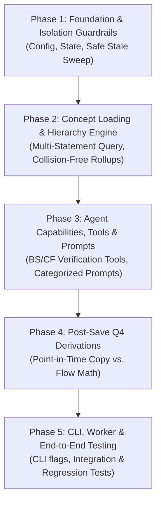

# Multi-Statement Extraction Pipeline Implementation Plan
## Balance Sheet, Cash Flow & Income Statement Unified Flow

This document outlines the complete architectural, data model, prompt, tooling, and derivation changes required to expand the SEC 8-K earnings extraction pipeline to support **Balance Sheet (`balancesheet`)** and **Cash Flow (`cashflow`)** statements in addition to the **Income Statement (`income`)**.

---

## 1. Architectural Overview & Design Invariants

Currently, the 8-K pipeline extracts metrics exclusively from the Income Statement (`statement_types=["income"]`). The database schema (`normalize_data.normalized_concepts_*` and `normalize_data.concept_values_*`) is already statement-agnostic and stores concepts and values for `income`, `balancesheet`, and `cashflow`.

The goal is to enable unified multi-statement extraction in the **single-pass ReAct agent loop** while adhering to core pipeline invariants:

1. **Single Extraction Pass**: The extraction agent navigates and extracts metrics across all targeted financial statements in one go. No separate agent loops per statement.
2. **Schema Uniformity**: Retain the exact same MongoDB collection targets (`concept_values_quarterly` / `concept_values_annual`).
3. **Isolation & Safety (Atomic Sweep)**: Processing a subset of statements (e.g., `--statements income`) must NEVER delete or corrupt existing records from other statements (e.g., `balancesheet`) during the atomic stale sweep.
4. **Collision-Free Hierarchy Rollups**: XBRL paths (such as `001.001`) that overlap between statements must be strictly scoped as `(statement_type, path)` so CALC formulas remain statement-contained.
5. **Accurate Q4 Derivation Semantics**: Distinguish point-in-time metrics (Balance Sheet, Cash Ending) where $Q4 = Annual$ from duration/flow metrics (Income Statement, Cash Flow activities) where $Q4 = Annual - (Q1 + Q2 + Q3)$.

---

## 2. Implementation Phases & Step-by-Step Execution Plan

The implementation is broken down into **5 sequential phases**. Each phase contains explicit objectives, files to modify, concrete code patterns, and validation criteria.



---

### Phase 1: Foundation, Configuration & Database Isolation Guardrails
> **Objective**: Enable statement selection through configuration and state, and protect existing database records by making the atomic stale sweep statement-scoped.

#### Step 1.1: Configuration Settings (`src/earnings_agents/config.py`)
* Add `TARGET_STATEMENTS` to `Settings`.
* Support comma-separated strings via environment variable `TARGET_STATEMENTS` (e.g. `TARGET_STATEMENTS="income,balancesheet,cashflow"`).
```python
# src/earnings_agents/config.py
class Settings(BaseSettings):
    ...
    TARGET_STATEMENTS: list[str] = Field(
        default_factory=lambda: ["income", "balancesheet", "cashflow"],
        description="Target financial statements to extract: income, balancesheet, cashflow",
    )

    @field_validator("TARGET_STATEMENTS", mode="before")
    def parse_target_statements(cls, v: Any) -> list[str]:
        if isinstance(v, str):
            return [s.strip().lower() for s in v.split(",") if s.strip()]
        return v
```

#### Step 1.2: Pipeline State Model (`src/earnings_agents/state.py`)
* Add `target_statements` to `State` with validation and default fallback.
```python
# src/earnings_agents/state.py
class State(BaseModel):
    ...
    target_statements: list[str] = Field(
        default_factory=lambda: ["income", "balancesheet", "cashflow"],
        description="Statements targeted for extraction in this run",
    )
```

#### Step 1.3: Safe Stale Sweep in Atomic Upsert (`src/earnings_agents/integrations/normalize.py`)
* **The Hazard**: Currently, `upsert_concept_values` issues a stale sweep deleting all records for `(cik, fiscal_year, quarter)` where `save_token != current_token`. If extraction runs for `income` only, any pre-existing `balancesheet` or `cashflow` records for that period would be wiped!
* **The Fix**: Add `target_statements: list[str] | None = None` to `upsert_concept_values`. Restrict the stale sweep query to only the statements processed during the current run:
```python
# src/earnings_agents/integrations/normalize.py
def upsert_concept_values(
    cik: str,
    period: DetectedPeriod,
    values: list[ConceptValueDoc],
    target_statements: list[str] | None = None,
    save_token: str | None = None,
    ...
) -> int:
    ...
    # Stale sweep query MUST filter by targeted statement types
    stale_query: dict[str, Any] = {
        "cik": cik,
        "reporting_period.fiscal_year": period.fiscal_year,
        "reporting_period.quarter": period.quarter,
        "save_token": {"$ne": save_token},
    }
    if target_statements:
        stale_query["statement_type"] = {"$in": target_statements}

    delete_result = col.delete_many(stale_query)
```

#### Step 1.4: Update Save Node (`src/earnings_agents/nodes/save.py`)
* In `mongodb_save_node`, forward `state.target_statements` to `upsert_concept_values`:
```python
upsert_concept_values(
    cik=state.cik,
    period=period,
    values=values_to_save,
    target_statements=state.target_statements,
    save_token=save_token,
)
```

#### Phase 1 Verification Criteria:
* Unit test verifying `upsert_concept_values` deletes ONLY the targeted statement types when `save_token` differs, leaving other statement records intact in MongoDB.
* Config parses string lists and default fallback as expected.

---

### Phase 2: Concept Universe & Hierarchy Engine Disambiguation
> **Objective**: Load multi-statement concepts into state and resolve hierarchy path collisions so CALC rollups work across statements without crosstalk.

#### Step 2.1: Multi-Statement Concept Query (`src/earnings_agents/nodes/concepts.py`)
* Modify `load_company_concepts_node` to use `state.target_statements` instead of the hardcoded `["income"]`:
```python
# src/earnings_agents/nodes/concepts.py
target_statements = state.target_statements or ["income"]
concepts = get_statement_concepts(state.cik, target_statements, period=detected)
```
* Note: `get_recently_valued_concept_ids` in `integrations/normalize.py` queries `(cik, period)` without filtering by statement type, which automatically provides recent priority signals for BS and CF.

#### Step 2.2: Collision-Free Hierarchy Grouping (`src/earnings_agents/agent/derive.py`)
* **The Problem**: SEC XBRL taxonomy structures use paths like `001.001` or `001.002` independently within each statement. Total Revenue in `income` might have path `001.001`, while Current Assets in `balancesheet` has path `001.001`. Grouping strictly by `path` causes unrelated rows from different statements to be combined into invalid parent-child trees.
* **The Solution**: Update `_build_hierarchy` to index by `(statement_type, path)`:
```python
# src/earnings_agents/agent/derive.py
def _build_hierarchy(concepts: list[ConceptRow]) -> dict[tuple[str, str], list[ConceptRow]]:
    grouped: dict[tuple[str, str], list[ConceptRow]] = {}
    for c in concepts:
        key = (c.statement_type, c.path)
        grouped.setdefault(key, []).append(c)
    return grouped
```

#### Step 2.3: Statement-Scoped CALC Formulas (`src/earnings_agents/agent/derive.py`)
* Update `build_calc_derivation_block` to look up children and parents matching both `statement_type` and parent path prefix.
* Ensure Gross Profit shortcut ($GP = Rev - |CoR|$) only executes for `statement_type == "income"`.
* For `balancesheet`, parent rollups represent structural totals (e.g. Current Assets + Non-Current Assets = Total Assets).
* For `cashflow`, parent rollups represent section totals (Operating, Investing, Financing).

#### Phase 2 Verification Criteria:
* Unit test loading mock concepts across IS, BS, and CF with identical paths (e.g. `001.001`) and confirming `_build_hierarchy` and `build_calc_derivation_block` produce separate, correctly scoped formulas.

---

### Phase 3: Extraction Agent Capabilities, Tooling & Prompt Architecture
> **Objective**: Enable the single-pass ReAct agent to find, interpret, verify, and extract metrics across all three financial statements.

#### Step 3.1: Financial Identity Verification Tools (`src/earnings_agents/agent/tools.py`)
Implement deterministic verification tools for Balance Sheet and Cash Flow alongside the existing `verify_identity` (Gross Profit):

1. **Balance Sheet Equation Tool**:
```python
@tool
def verify_balance_sheet_identity(total_assets: float, total_liabilities: float, total_equity: float) -> str:
    """Verify that Total Assets = Total Liabilities + Total Equity.
    
    Use this tool after reading the Balance Sheet to confirm numbers match the accounting equation.
    """
    rhs = round(total_liabilities + total_equity, 4)
    diff = round(total_assets - rhs, 4)
    if abs(diff) < 0.05:
        return f"VALID: Total Assets ({total_assets}) equals Liabilities + Equity ({rhs})."
    return (
        f"MISMATCH: Assets ({total_assets}) != Liabilities ({total_liabilities}) + Equity ({total_equity}). "
        f"Difference: {diff}. Check table columns, units, or sign conventions."
    )
```

2. **Cash Flow Equation Tool**:
```python
@tool
def verify_cash_flow_identity(operating_cf: float, investing_cf: float, financing_cf: float, net_change: float) -> str:
    """Verify that Net Change in Cash = Operating CF + Investing CF + Financing CF.
    
    Use this tool after reading the Statement of Cash Flows to verify the section cash flows sum to the reported net change.
    """
    sum_cf = round(operating_cf + investing_cf + financing_cf, 4)
    diff = round(net_change - sum_cf, 4)
    if abs(diff) < 0.05:
        return f"VALID: Net change in cash ({net_change}) matches sum of cash flows ({sum_cf})."
    return (
        f"MISMATCH: Reported net change ({net_change}) != Operating ({operating_cf}) + Investing ({investing_cf}) "
        f"+ Financing ({financing_cf}) = {sum_cf}. Difference: {diff}."
    )
```
* Register both tools in `build_extraction_tools()` in `src/earnings_agents/agent/tools.py`.

#### Step 3.2: Rebuild Concept Target Formatting (`src/earnings_agents/agent/prompts.py`)
* Update `build_concept_list` to partition concepts by statement type under clear Markdown headers:
```markdown
### INCOME STATEMENT CONCEPTS (Duration / Flow)
- [us-gaap:Revenues] Revenues
- [us-gaap:OperatingIncomeLoss] Operating Income

### BALANCE SHEET CONCEPTS (Point-in-Time / As of Period End)
- [us-gaap:AssetsCurrent] Total Current Assets
- [us-gaap:CashAndCashEquivalentsAtCarryingValue] Cash and Cash Equivalents
- [us-gaap:StockholdersEquity] Total Stockholders' Equity

### CASH FLOW STATEMENT CONCEPTS (Duration / Flow)
- [us-gaap:NetCashProvidedByUsedInOperatingActivities] Net Cash Provided by Operating Activities
- [us-gaap:NetCashProvidedByUsedInInvestingActivities] Net Cash Used in Investing Activities
- [us-gaap:NetCashProvidedByUsedInFinancingActivities] Net Cash Used in Financing Activities
```

#### Step 3.3: System Prompt Revision (`PIPELINE_SYSTEM_PROMPT`)
* **Remove Exclusion Directives**:
  - Delete: `WHAT TO IGNORE: Balance sheet data, Cash flow statement data`
* **Inject Multi-Statement Instructions**:
  - Direct the agent to search for and extract from the **Income Statement**, **Condensed Balance Sheet**, and **Statement of Cash Flows** (which often reside across exhibits, e.g. EX-99.1 or EX-99.2/99.3 supplementals).
  - **Label Disambiguation Rule**: Explicitly instruct that duplicate labels (e.g., "Net Income" which appears on both Income Statement and Cash Flow) must map strictly to their respective bracketed taxonomy key under the appropriate statement header.
  - **Column Alignment Guidance**: Remind the agent that Balance Sheets report **point-in-time** headers ("As of September 30, 2024") whereas Income Statements and Cash Flows report **duration** headers ("Three Months Ended September 30, 2024"). The agent must select columns corresponding to the detected reporting period.

#### Phase 3 Verification Criteria:
* Agent unit tests confirm `verify_balance_sheet_identity` and `verify_cash_flow_identity` return proper responses for balanced and unbalanced inputs.
* Rendered prompts show cleanly separated sections and updated system guidelines.

---

### Phase 4: Post-Save Q4 Derivations & Statement Semantics
> **Objective**: Accurately calculate Q4 figures for annual filings based on financial statement semantics (point-in-time vs. duration).

#### Step 4.1: Financial Semantics in Q4 Derivation (`src/earnings_agents/integrations/q4.py`)
When deriving Q4 after saving an `ANNUAL` filing, the mathematical logic depends on the financial statement type:
1. **Income Statement (`income`)**: Duration/Flow metric.
   $$Q4 = Annual - (Q1 + Q2 + Q3)$$
2. **Balance Sheet (`balancesheet`)**: Point-in-time metric.
   The ending balance at the close of the fiscal year is identical to the Q4 ending balance.
   $$Q4 = Annual$$
   (Direct copy; no prior quarter subtraction).
3. **Cash Flow Statement (`cashflow`)**:
   - Periodic cash flows (Operating, Investing, Financing activities): Duration/Flow metric.
     $$Q4 = Annual - (Q1 + Q2 + Q3)$$
   - Ending balances (Cash, Cash Equivalents, and Restricted Cash at end of period): Point-in-time metric.
     $$Q4 = Annual$$

#### Step 4.2: Implementation in `calculate_q4_for_period`
Update `calculate_q4_for_period` in `src/earnings_agents/integrations/q4.py`:
```python
# src/earnings_agents/integrations/q4.py
def _is_point_in_time_concept(concept_doc: dict[str, Any]) -> bool:
    stmt = concept_doc.get("statement_type", "income")
    if stmt == "balancesheet":
        return True
    if stmt == "cashflow":
        tax_key = (concept_doc.get("taxonomy_key") or "").lower()
        label = (concept_doc.get("label") or "").lower()
        # Ending cash balance concepts are point-in-time
        if "cashandcashequivalentsatcarryingvalue" in tax_key or "cashandcashequivalentsendofperiod" in tax_key:
            return True
        if "at end of period" in label or "end of year" in label:
            return True
    return False
```
* If `_is_point_in_time_concept` is `True`:
  Directly write `q4_doc["value"] = annual_doc["value"]` with `q4_doc["calculated"] = True` and note `"method": "point_in_time_copy"`.
* Else:
  Execute the standard $Annual - \sum(Q1, Q2, Q3)$ flow calculation.

#### Step 4.3: Node Observability Update (`src/earnings_agents/nodes/q4.py`)
* Update `calculate_q4_node` state reporting to log derived count breakdowns per statement:
  `derived_counts: {"income": 18, "balancesheet": 24, "cashflow": 12}`.

#### Phase 4 Verification Criteria:
* Unit tests in `tests/test_q4.py` verifying:
  - Balance sheet concepts copy the annual value directly to Q4.
  - Cash flow ending cash copies the annual value.
  - Income statement and operating cash flow subtract $Q1 + Q2 + Q3$ from Annual.

---

### Phase 5: CLI, Worker Integration & End-to-End Validation
> **Objective**: Provide user/worker entrypoint flags, run end-to-end integration tests, and verify 100% backward compatibility.

#### Step 5.1: CLI Flag Support (`src/earnings_agents/cli/earnings.py`)
Add `--statements` / `-s` to the CLI:
```python
# src/earnings_agents/cli/earnings.py
@click.option(
    "--statements",
    "-s",
    default=None,
    help="Comma-separated financial statements to extract (e.g. 'income,balancesheet,cashflow'). Defaults to config.",
)
```
Pass the parsed list to initial graph state:
```python
target_statements = (
    [s.strip().lower() for s in statements.split(",") if s.strip()]
    if statements
    else settings.TARGET_STATEMENTS
)
initial_state = State(
    ticker=ticker.upper(),
    target_statements=target_statements,
    ...
)
```

#### Step 5.2: Worker Payload Handling (`src/earnings_agents/cli/worker.py`)
* If the Redis job queue payload specifies `statements: [...]`, propagate it to `State.target_statements`. If absent, fallback to `settings.TARGET_STATEMENTS`.

#### Phase 5 Verification Criteria:
* Unit tests in `tests/test_multi_statement_phase5.py` verifying:
  - CLI argument parsing for `--statements` / `-s` (defaults, comma-separated lists, casing/whitespace).
  - Initial state construction forwarding `target_statements` into graph state.
  - Worker payload extraction from `statements` or `target_statements` (list or string), with fallback to worker CLI default and config.
  - Full test suite passes hermetically (250 tests).
* **Status**: [COMPLETED]

---

## 3. Risk Assessment & Mitigation

| Risk | Impact | Mitigation Strategy |
|---|---|---|
| **Context Window Overflow** | High | Balance Sheet and Cash Flow add ~40-70 concept targets. The prompt concept list stays concise, and prioritize recent concept rows (`get_recently_valued_concept_ids`) while omitting unvalued rows without history. |
| **Label Crosstalk ("Net Income")** | Medium | Strict visual section grouping in prompts + explicit prompt instructions requiring mapping to the concept under the respective section. |
| **Accidental Data Deletion** | Critical | The stale sweep query in `upsert_concept_values` is strictly constrained by `statement_type: {"$in": target_statements}`. |
| **Missing Tables in Press Releases** | Low | Some 8-K press releases only contain Income Statements and abbreviated Balance Sheets (no Cash Flow). The agent ReAct loop handles absent metrics gracefully via `__missing__`, never failing the run if a statement is omitted by the company. |
